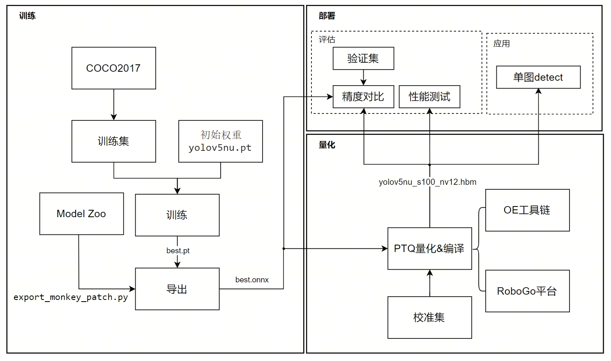

# RDK S100：YOLOv5nu 从训练到部署

本手册旨在帮助具备基础 Linux 和命令行经验的开发者，快速完成基于 RDK S100 的模型训练、量化与板端部署。



本篇先完成 Stage 0–2：获取项目，训练 YOLOv5nu，建立 FP32 基线，导出六路 ONNX，再用 OpenExplorer 3.7.0 生成 `yolov5nu_s100_nv12.hbm`。开始前，请确认开发主机已安装 Linux 或 WSL、Conda、Docker、Git 和 `wget`。

## Stage 0：项目与基础环境

### 0.1 获取项目

执行位置：开发主机。

```bash
# 统一项目、工具链和下载目录，后文直接复用这些变量。
export S100_WORKSPACE="$HOME/s100-yolov5u-workspace"
export PROJECT_ROOT="$S100_WORKSPACE/s100_yolov5u_train2deploy"
export TOOLCHAIN_ROOT="$S100_WORKSPACE/toolchain"
export DOWNLOAD_ROOT="$TOOLCHAIN_ROOT/downloads"
export OE_ROOT="$TOOLCHAIN_ROOT/drobotics_s100_s600_open_explorer_v3.7.0"

# 创建工作区和大文件下载目录。
mkdir -p "$S100_WORKSPACE" "$DOWNLOAD_ROOT"
# 将代码、固定数据集、脚本和文档克隆到项目目录。
git clone git@github.com:Lutra-wang/s100_yolov5u_train2deploy.git "$PROJECT_ROOT"
```

仓库中与本阶段相关的目录如下：

```text
s100_yolov5u_train2deploy/
├── data/coco2017_val128_s100/  # 固定的训练、验证和测试数据
├── train/                     # Ultralytics 源码和训练输出
├── exchange/onnx/             # ONNX 交换模型
├── conversion/                # 校准图和 OE 编译输出
├── validation/                # 精度评估 JSON
├── scripts/                   # 评估与部署辅助脚本
└── docs/                      # 手册和证据文档
```

仓库不包含 OE 镜像和安装包；这些大文件在下一节下载。

### 0.2 配置 OpenExplorer

执行位置：开发主机。

```bash
# 支持断点续传，下载 OE 3.7.0 CPU 镜像包。
wget -c -P "$DOWNLOAD_ROOT" \
  https://d-robotics-aitoolchain.oss-cn-beijing.aliyuncs.com/oe/3.7.0/ai_toolchain_ubuntu_22_s100_s600_cpu_v3.7.0.tar
# 下载与镜像版本一致的 OE 工具链包。
wget -c -P "$DOWNLOAD_ROOT" \
  https://d-robotics-aitoolchain.oss-cn-beijing.aliyuncs.com/oe/3.7.0/oe-package-3.7.0-s100-s600.tgz

# 将 OE 镜像导入本机 Docker。
docker load -i "$DOWNLOAD_ROOT/ai_toolchain_ubuntu_22_s100_s600_cpu_v3.7.0.tar"
# 把工具链解压到独立目录，不与 Git 仓库混放。
tar -xf "$DOWNLOAD_ROOT/oe-package-3.7.0-s100-s600.tgz" -C "$TOOLCHAIN_ROOT"
```

本阶段只完成下载、镜像加载和工具链解压，暂不进入容器。预期 `$OE_ROOT/run_docker.sh` 已存在；若不存在，先确认压缩包是否完整以及解压目录是否正确。

## Stage 1：模型训练与导出

### 1.1 配置训练环境

执行位置：开发主机。

```bash
# 定义数据集、训练、Model Zoo 和 ONNX 路径。
export DATASET_ROOT="$PROJECT_ROOT/data/coco2017_val128_s100"
export TRAIN_ROOT="$PROJECT_ROOT/train"
export ULTRALYTICS_ROOT="$TRAIN_ROOT/ultralytics"
export MODEL_ZOO_ROOT="$PROJECT_ROOT/model_zoo_s"
export ONNX_ROOT="$PROJECT_ROOT/exchange/onnx"

# 获取经本案例验证的 Ultralytics 和 S100 Model Zoo 分支。
git clone --branch v8.4.152 --single-branch \
  https://github.com/ultralytics/ultralytics.git "$ULTRALYTICS_ROOT"
git clone --branch s100 --single-branch \
  https://github.com/D-Robotics/rdk_model_zoo_s.git "$MODEL_ZOO_ROOT"

# 创建 Python 3.10 训练环境，并在本手册中只进入一次。
conda create -y -n oe-s100-yolov5u python=3.10 pip
conda activate oe-s100-yolov5u
# 安装 CPU 版 PyTorch、项目版 Ultralytics 及评估/检查依赖。
python -m pip install torch torchvision --index-url https://download.pytorch.org/whl/cpu
python -m pip install -e "$ULTRALYTICS_ROOT" pycocotools onnx
```

后续 Stage 1 命令都在这个 Conda 环境中执行。

### 1.2 准备项目数据集

执行位置：开发主机 / Conda 环境。

本案例直接使用仓库内的固定数据集，不需要额外下载 COCO。`dataset.yaml` 定义训练数据路径，`images/test` 与 `annotations/instances_test.json` 用于固定测试集评估。

```bash
# 只列出本阶段必需的数据配置和标注，确认克隆内容完整。
ls -l "$DATASET_ROOT/dataset.yaml" \
  "$DATASET_ROOT/annotations/instances_test.json"
# 只把 YAML 顶层 path 改为当前克隆的数据集绝对路径。
sed -i "s|^path:.*|path: $DATASET_ROOT|" "$DATASET_ROOT/dataset.yaml"
```

仓库中的 YAML 保留了制作数据时的源路径，因此训练前必须将 `path:` 适配为当前 `$DATASET_ROOT`。如果任一文件不存在，请先更新项目仓库，不要自行改用其他数据集。

### 1.3 训练 YOLOv5nu

执行位置：开发主机 / Conda 环境。

`yolo` 是 Ultralytics 命令行工具，`detect train` 用于训练目标检测模型。

```bash
# 从官方 YOLOv5nu 预训练权重开始，使用项目数据配置训练。
yolo detect train \
  model=yolov5nu.pt data="$DATASET_ROOT/dataset.yaml" \
  imgsz=640 epochs=10 batch=8 workers=0 device=cpu \
  project="$TRAIN_ROOT/runs" name=coco2017_val128_s100 \
  seed=20260915 deterministic=True exist_ok=True

# exist_ok=True 将输出稳定在同一目录，后续命令不需要猜测数字后缀。
RUN="$TRAIN_ROOT/runs/coco2017_val128_s100"
```

本步生成 `$RUN/weights/best.pt`；这是后续评估和导出使用的最优权重。若该文件未生成，先回看训练终端的首个报错。

<!-- IMAGE_SLOT:S1-01 -->
> **待补图 S1-01｜训练完成结果**
> 建议文件：`docs/images/S1-01-training-complete.png`
> 截图内容：训练结束终端、best.pt 路径和关键指标。
> 图注：YOLOv5nu 训练完成并生成最优权重。

### 1.4 建立 FP32 精度基线

执行位置：开发主机 / Conda 环境。

```bash
# 固定测试集标注，确保 FP32 与后续 BPU 评估口径一致。
ANN="$DATASET_ROOT/annotations/instances_test.json"

# 用 best.pt 对测试图推理，输出 COCO 预测 JSON。
python "$PROJECT_ROOT/scripts/evaluate_coco_official.py" fp32-to-json \
  --weights "$RUN/weights/best.pt" \
  --images-dir "$DATASET_ROOT/images/test" \
  --annotations "$ANN" \
  --output "$PROJECT_ROOT/validation/quantization_fp32_predictions.json" \
  --imgsz 640 --conf 0.25 --iou 0.7
# 调用 pycocotools 计算并保存 FP32 指标。
python "$PROJECT_ROOT/scripts/evaluate_coco_official.py" evaluate \
  --annotations "$ANN" \
  --predictions "$PROJECT_ROOT/validation/quantization_fp32_predictions.json" \
  --metrics "$PROJECT_ROOT/validation/quantization_fp32_metrics.json"
```

指标写入 `validation/quantization_fp32_metrics.json`。仓库已有的 16 图实测记录为 mAP50 `0.388`、mAP50-90 `0.292`、mAP50-95 `0.266`；小样本结果用于本链路回归，不代表完整 COCO2017 基准。

<!-- IMAGE_SLOT:S1-02 -->
> **待补图 S1-02｜FP32 精度结果**
> 建议文件：`docs/images/S1-02-fp32-metrics.png`
> 截图内容：FP32 的三项 mAP 终端结果。
> 图注：固定测试集上的 FP32 精度基线。

### 1.5 导出 ONNX

执行位置：开发主机 / Conda 环境。

Ultralytics 默认导出面向通用推理；Model Zoo 的 `export_monkey_patch.py` 调整输出形式，使其匹配 S100 量化和部署代码。

```bash
# 导出 Model Zoo 适配的六输出 ONNX。
python "$MODEL_ZOO_ROOT/samples/Vision/ultralytics_yolo/x86/export_monkey_patch.py" \
  --pt "$RUN/weights/best.pt" --optse 11
# 使用固定交付名保存 ONNX。
mkdir -p "$ONNX_ROOT"
cp "$RUN/weights/best.onnx" "$ONNX_ROOT/yolov5nu_coco2017_val128_s100.onnx"
# 让 ONNX 检查器验证模型结构；成功时输出 onnx-ok。
python -c "import onnx; onnx.checker.check_model('$ONNX_ROOT/yolov5nu_coco2017_val128_s100.onnx'); print('onnx-ok')"
```

六路输出由三组特征层的 cls 和 bbox 组成：

| 特征层 | cls | bbox |
|---|---|---|
| s8 | `output0` `[1,80,80,80]` | `371` `[1,80,80,64]` |
| s16 | `379` `[1,40,40,80]` | `387` `[1,40,40,64]` |
| s32 | `395` `[1,20,20,80]` | `403` `[1,20,20,64]` |

其中 `80` 是 COCO 类别数，`64` 是 YOLOv5u 的 bbox 分布输出。

<!-- IMAGE_SLOT:S1-03 -->
> **待补图 S1-03｜ONNX 六路输出**
> 建议文件：`docs/images/S1-03-onnx-six-outputs.png`
> 截图内容：ONNX 的三组 cls/bbox 输出名称和形状。
> 图注：Model Zoo 适配导出的六路 ONNX 输出。

## Stage 2：模型量化与编译

### 2.1 配置量化环境

执行位置：先在开发主机准备目录和校准图，再进入 OE 容器。

```bash
# 重建 Stage 2 所需主机路径，便于从新终端继续执行。
export S100_WORKSPACE="$HOME/s100-yolov5u-workspace"
export PROJECT_ROOT="$S100_WORKSPACE/s100_yolov5u_train2deploy"
export TOOLCHAIN_ROOT="$S100_WORKSPACE/toolchain"
export OE_ROOT="$TOOLCHAIN_ROOT/drobotics_s100_s600_open_explorer_v3.7.0"
export DATASET_ROOT="$PROJECT_ROOT/data/coco2017_val128_s100"

# 创建校准与输出目录，并按文件名取训练集前 20 张图。
mkdir -p "$PROJECT_ROOT/conversion/cal_images" "$PROJECT_ROOT/conversion/output"
find "$DATASET_ROOT/images/train" -maxdepth 1 -name '*.jpg' | sort | head -20 \
  | xargs -r -I{} cp '{}' "$PROJECT_ROOT/conversion/cal_images/"

# 从 OE 工具链启动本手册唯一一次交互式量化容器。
cd "$OE_ROOT"
bash run_docker.sh "$PROJECT_ROOT" cpu
```

该命令使主机项目目录与容器 `/data` 共享同一组文件。从下一节开始，命令均在容器 `/data` 中执行。

### 2.2 准备校准集

执行位置：OE 容器。

2.1 已在主机从训练集按文件名排序选取 20 张图；由于目录共享，容器中可直接读取 `/data/conversion/cal_images`。校准集只用于确定 PTQ 数值范围，不参与模型训练。

```bash
# 输出应为 20；不足时先检查训练集路径和图片扩展名。
find /data/conversion/cal_images -maxdepth 1 -name '*.jpg' | wc -l
```

### 2.3 使用 mapper.py 完成 PTQ 与编译

执行位置：OE 容器。

`mapper.py` 是 Model Zoo 提供的转换入口，会串联预处理配置、PTQ 和编译。PTQ（训练后量化）用校准图估计数值范围，无需重新训练模型。日志中首次出现的 `hb_compile` 是 OE 编译阶段，它把量化模型编译为 S100 可执行的 HBM，无需单独运行。

```bash
# 进入转换工作目录。
cd /data/conversion
# 以 nash-e 为目标，使用 16 个并行任务和 O2 优化完成 PTQ 与编译。
python3 /data/model_zoo_s/samples/Vision/ultralytics_yolo/x86/mapper.py \
  --onnx /data/exchange/onnx/yolov5nu_coco2017_val128_s100.onnx \
  --cal-images /data/conversion/cal_images \
  --output-dir /data/conversion/output \
  --march nash-e --jobs 16 --optimize-level O2 --save-cache True

# 找到 mapper 生成的 NV12 HBM，并统一为对外交付名。
HBM_SOURCE="$(find /data/conversion/output -maxdepth 1 -type f \
  -name '*_nashe_640x640_nv12.hbm' | sort | head -1)"
mv "$HBM_SOURCE" /data/conversion/output/yolov5nu_s100_nv12.hbm
# 列出编译产物和大小。
ls -lh /data/conversion/output/
```

编译成功时，日志包含 `The hb_compile completes running.`，且最终模型为 `/data/conversion/output/yolov5nu_s100_nv12.hbm`。

<!-- IMAGE_SLOT:S2-01 -->
> **待补图 S2-01｜OE 编译完成**
> 建议文件：`docs/images/S2-01-compile-complete.png`
> 截图内容：OE 编译完成终端。
> 图注：OpenExplorer 完成 PTQ 与 HBM 编译。

### 2.4 查看量化结果

执行位置：OE 容器。

`conversion/output/hb_compile.log` 记录六路输出的 calibrated/quantized cosine。cosine 越接近 1，表示量化前后对应输出越接近；它是输出张量诊断，不等于数据集精度。本项目实测值如下：

| 输出 | Calibrated Cosine | Quantized Cosine |
|---|---:|---:|
| `output0` | 0.999866 | 0.986857 |
| `371` | 0.995730 | 0.993678 |
| `379` | 0.999687 | 0.999504 |
| `387` | 0.996379 | 0.994489 |
| `395` | 0.999411 | 0.999124 |
| `403` | 0.995772 | 0.993587 |

```bash
# 快速定位六路输出的量化诊断行。
grep -E 'output0|371|379|387|395|403' /data/conversion/output/hb_compile.log
```

量化阶段的主要产物是 `conversion/output/hb_compile.log` 和 `conversion/output/yolov5nu_s100_nv12.hbm`。

<!-- IMAGE_SLOT:S2-02 -->
> **待补图 S2-02｜六路量化 cosine**
> 建议文件：`docs/images/S2-02-six-output-cosine.png`
> 截图内容：六路 calibrated/quantized cosine。
> 图注：六路输出的量化前后余弦相似度。

### 2.5 RoboGo 量化

RoboGo 量化将在后续补充截图和经验证的平台流程。
